Markdown
# Gerenciador de Eventos 

Um sistema de gestão de eventos, desenvolvido para facilitar a criação de atividades, inscrições de participantes e validação de presença em tempo real utilizando leitura de QR Codes.

# Link do Sistema publicado

Acesse pelo link:
[Clique Aqui](https://aki-xjvb.onrender.com/dashboard)

## Tecnologias Utilizadas

**Frontend:**
* React.js (com Vite)
* React Router DOM (Roteamento e rotas protegidas)
* HTML5-QRCode (Leitura de ingressos via câmera)

**Backend:**
* Node.js com Express
* Banco de Dados: MySQL / TiDB
* Autenticação: JWT (JSON Web Tokens) e Bcrypt (Criptografia de senhas)
* Upload de Imagens: Multer + Cloudinary (Integração em nuvem)

---

## Pré-requisitos

* [Node.js](https://nodejs.org/en/) (Versão 18 ou superior)
* Um servidor MySQL local (ou uma conta no TiDB Cloud)
* Uma conta gratuita no [Cloudinary](https://cloudinary.com/) para o upload de fotos.

---

## Configuração do Banco de Dados

1. Abra o seu gerenciador de banco de dados (ex: MySQL Workbench, DBeaver ou via terminal no WSL).
2. Crie um banco de dados vazio para o projeto:
   
   ```sql
   CREATE DATABASE gerenciador_eventos;
   USE gerenciador_eventos;
   ```
3. Copie e execute o arquivo SQL que está na raiz deste projeto **scriptCriacaoTabelas.sql**. 

## Configuração do Backend (API)

1. Navegue até a pasta do backend:

    ```Bash
    cd apiEventos
    ```
2. Instale as dependências do servidor:

    ```Bash
    npm install
    ```
3. Crie um arquivo chamado .env na raiz da pasta do backend e configure suas variáveis de ambiente:

    ```Plaintext
    # Configurações do Servidor e JWT
    DB_PORT=4000
    JWT_SECRET=uma_chave_qualquer_usada_nos_qrcodes

    # Configurações do Banco de Dados
    DB_HOST=localhost
    DB_USER=seu_usuario_mysql
    DB_PASSWORD=sua_senha_mysql
    DB_NAME=gerenciador_eventos

    # Configurações do Cloudinary (Fotos de Perfil)
    CLOUDINARY_CLOUD_NAME=seu_cloud_name
    CLOUDINARY_API_KEY=sua_api_key
    CLOUDINARY_API_SECRET=seu_api_secret
    ```
4. Inicie o servidor:

    ```Bash
    node server.js
    ```
## Configuração do Frontend 

``IMPORTANTE: Caso queira executar localmente, é necessário mudar para a branch versao-local.``

1. Abra um novo terminal e navegue até a pasta do frontend:

    ```Bash
    cd gerenciadorEventos
    ```
2. Instale as dependências da aplicação:

    ```Bash
    npm install
    ```
3. Inicie o servidor de desenvolvimento:

    ```Bash
    npm run dev
    ```
    O terminal exibirá o link local (geralmente http://localhost:5173). Abra-o no seu navegador.

## Acessos e Perfis
O sistema possui controle de acesso com base em papeis. Ao iniciar o sistema pela primeira vez, você pode criar uma conta na tela de cadastro.

Por padrão, novas contas são do tipo PARTICIPANTE. Para acessar os recursos de administração, altere o campo tipoPerfil do seu usuário diretamente no banco de dados para 'ADMINISTRADOR':

```SQL
UPDATE Usuario SET tipoPerfil = 'ADMINISTRADOR' WHERE idUsuario= SEUID;
```

## Principais Funcionalidades
Painel do Participante: Inscrição em atividades com limitação de vagas, visualização de carteira de ingressos (QR Codes) e upload de foto de perfil.

Painel de Organização: Criação de eventos e sub-atividades, monitoramento de métricas em tempo real (taxa de ocupação e presença), e exportação de relatórios em CSV.

Leitor de Check-in: Scanner de QR Code nativo no navegador com validação de horários, regras de permissão de acesso e validação visual através da foto de perfil E QR-Codes que expiram a cada 15 segundos.


# Prints do Sistema Funcionando

Aqui estão as telas organizadas por nível de acesso.

## Telas do admin

Telas exclusivas para admins.

### Tela Gerenciar Equipe

<div align="center">
  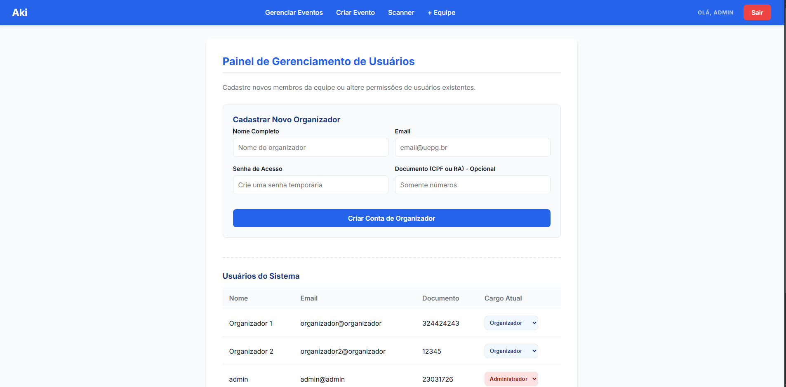
</div>

### Tela Gerenciar Equipe - Mobile

<div align="center">
  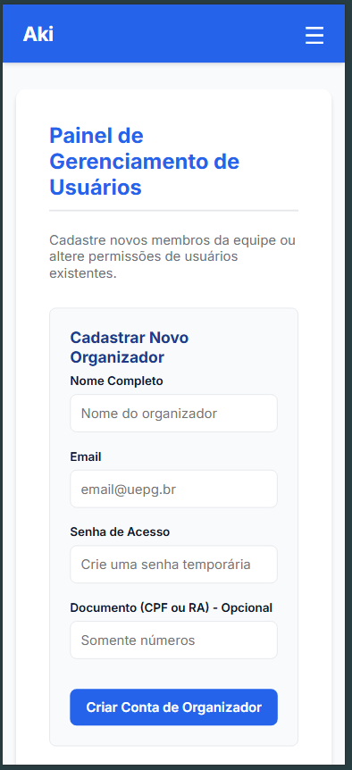
</div>


## Telas do admin e organizadores

Telas compartilhadas entre os dois cargos.

### Tela Editar Evento

<div align="center">
  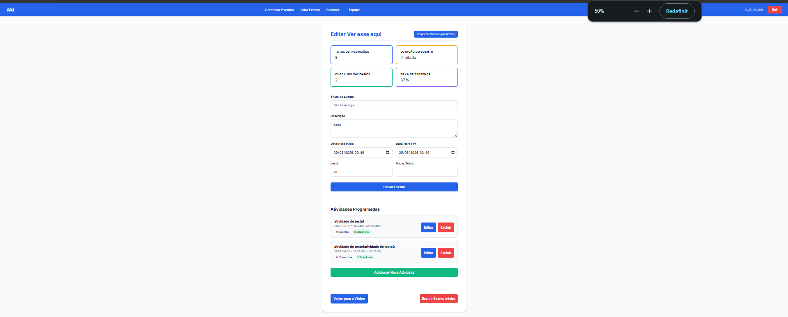
</div>

### Tela Editar Evento - Mobile

<div align="center">
  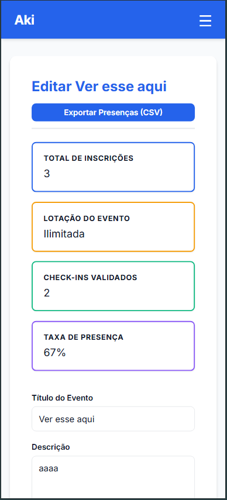
</div>

### Tela Scanner

<div align="center">
  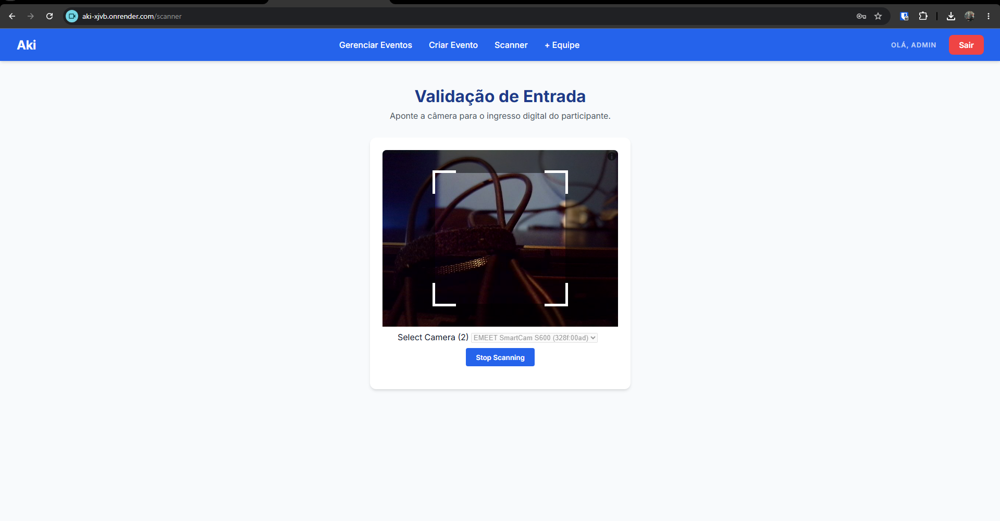
</div>

### Tela Scanner - Mobile

<div align="center">
  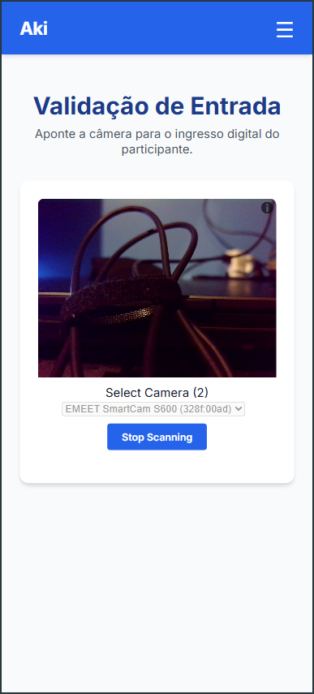
</div>

### Tela Criar Evento

<div align="center">
  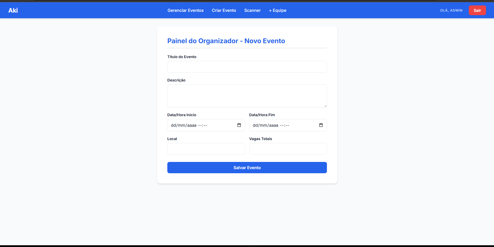
</div>

### Tela Criar Evento - Mobile

<div align="center">
  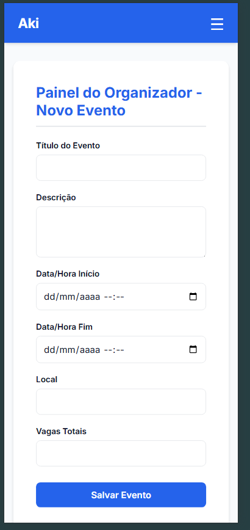
</div>

### Tela Gerenciar Eventos

<div align="center">
  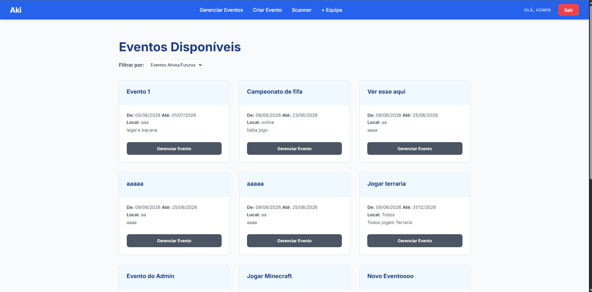
</div>

### Tela Gerenciar Eventos - Mobile

<div align="center">
  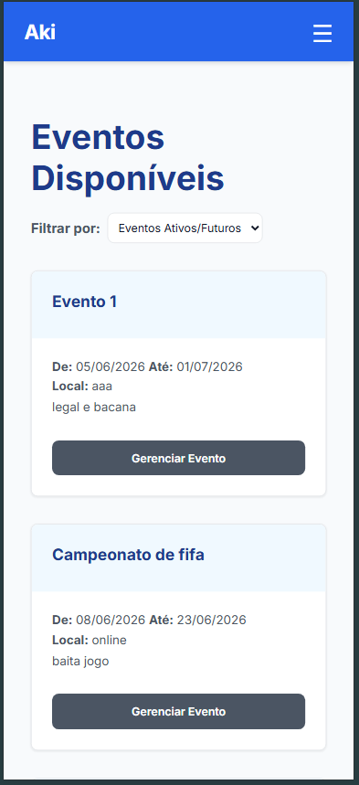
</div>

## Telas Participante

### Tela Minha Agenda

<div align="center">
  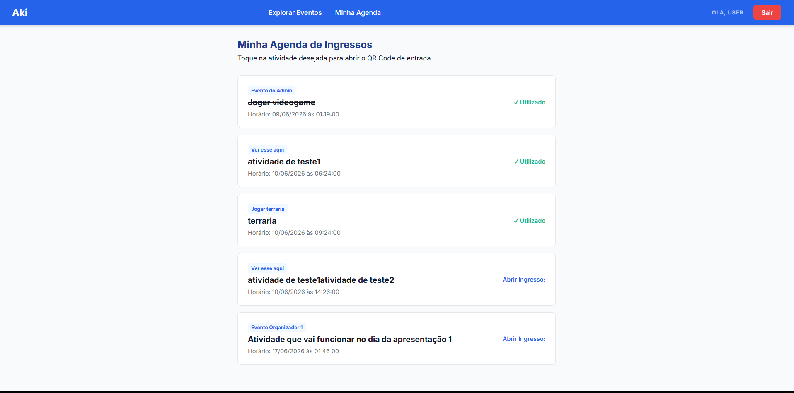
</div>

### Tela Minha Agenda - Mobile

<div align="center">
  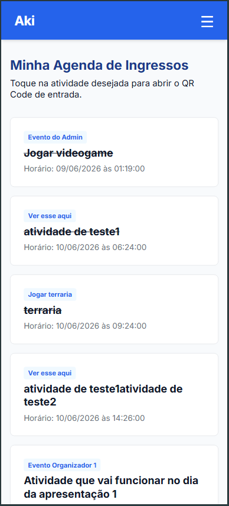
</div>

## Telas Públicas

### Tela Home

<div align="center">
  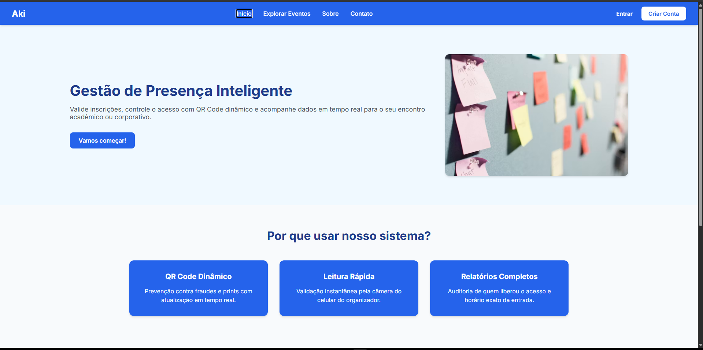
</div>

### Tela Home - Mobile

<div align="center">
  
</div>


### Tela Explorar Eventos

<div align="center">
  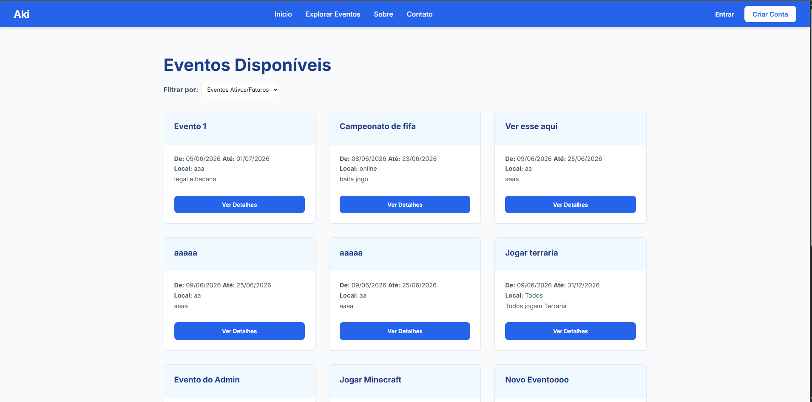
</div>

### Tela Explorar Eventos - Mobile

<div align="center">
  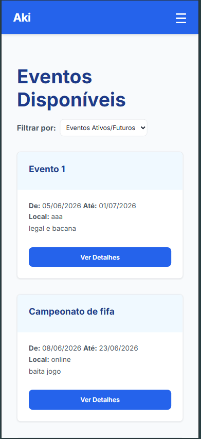
</div>

### Tela Sobre

<div align="center">
  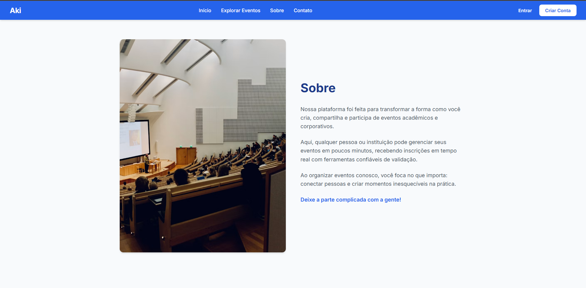
</div>

### Tela Sobre - Mobile

<div align="center">
  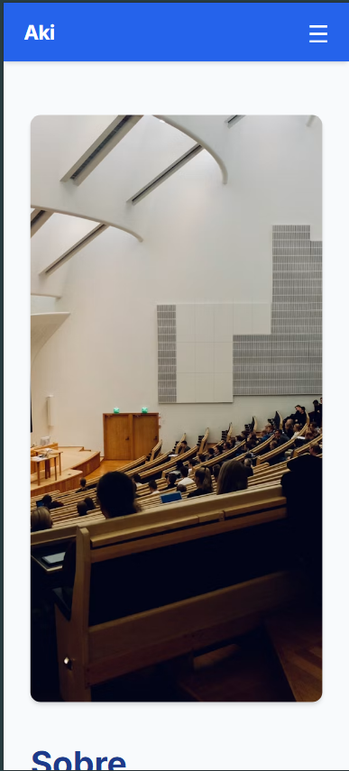
</div>

### Tela Contato

<div align="center">
  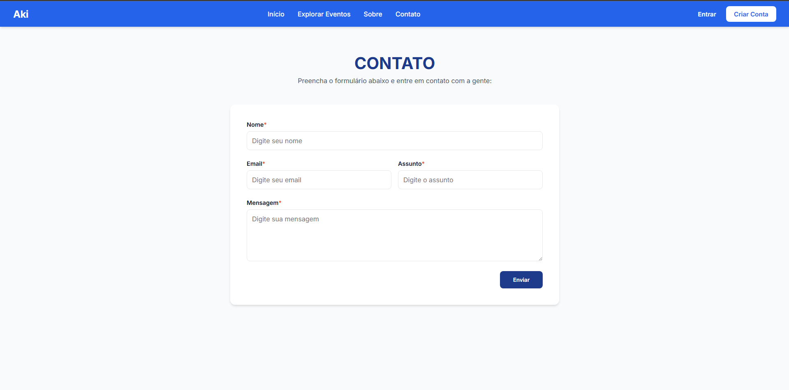
</div>

### Tela Contato - Mobile

<div align="center">
  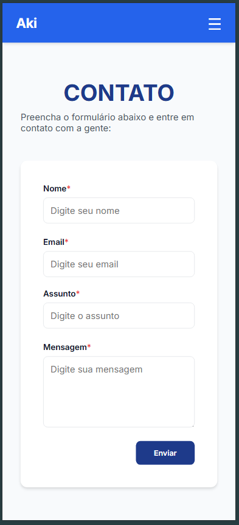
</div>